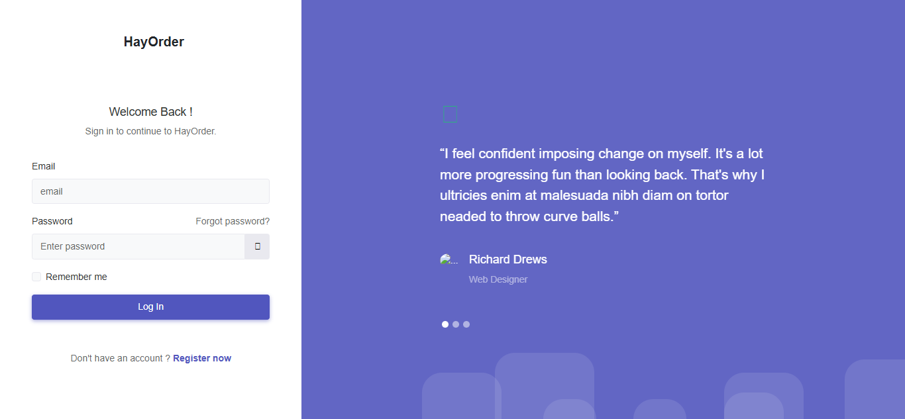

# HayOrder

HayOrder is a platform for restaurant owners who do not yet have their own ordering system. We are here to help restaurant owners get their own ordering system.

# Tech Stack HayOrder

**PHP:** Programming language for server-side logic.

**Filamennt:** The Laravel library used by administrators to manage users and verify restaurants created by owners.

**Laravel:** PHP framework for web application development.

**Bootstrap:** CSS framework to enhance the appearance of HayOrder.

**Minia:** This is a template needed by restaurant owners to manage their restaurants.

**Visual Studio Code:** Text editor used for development.

**MySql:** Database used for local development and testing.

# Screenshots

## Start Page

## Login Page

## Dashboard Owner

## Menu Page User

